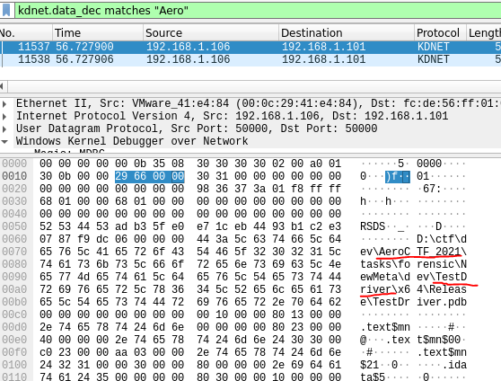
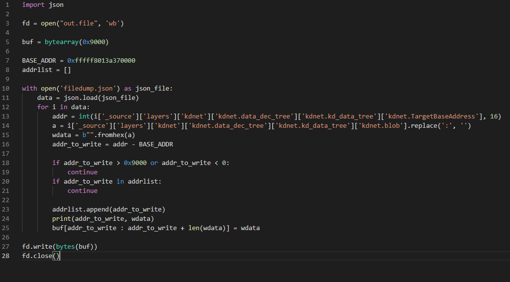

The task description tells us that some hacker was caught, and a RAM
dump was taken from his machine. Also, the hacker was debugging some
driver, and the debug traffic was recorded. Accordingly, we are
presented with two files.

Let's open the traffic file. There we see Windows kernel debug traffic,
which was encrypted, and nothing else.

If we want to decrypt the traffic, there is a public dissector that
supports decryption -
[[https://github.com/Lekensteyn/kdnet]{.ul}](https://github.com/Lekensteyn/kdnet).
But first we need to find a key. At this point, we need to analyze the
dump in order to understand which key was used.

The memory dump was taken from Windows 10x64_19041. Let's use volatility
to find what processes are running on the system.

In the processes list we can see «windbg.exe»

Since the traffic is encrypted, it may lead to the idea that the
encryption key may be hidden in the WinDBG dump. The following is not
the most obvious part of the solution, but if you look closely at the
list of processes, you can see the process \"Microsoft.Pho ..\" (this is
the first process in the list). This program is used to view images. It
means that some images are open on the computer, and we can look at
them. Dump the process and open it in GIMP.

We need an offset to display the image, luckily we can calculate it by
hands, and then see a piece of the password for WinDBG.

The first part of the key is «17890.». The key for WinDBG contains a few
parts which are splitted by dots. So now we can search for the key
inside the dump. The key is stored in memory in a transformed form. Each
part of the key is converted to bytes as a base 36 number. In this case,
each part of the key is 8 bytes.

Let's try to find this sequence in the dump:

As a result, we find the remaining bytes of the key:

At this stage, we no longer need a RAM dump and we need to use the key
we got, but first, convert it from bytes to the correct format (although
you can probably use the converted key immediately). As an option, you
can use this tool for conversion -
[[http://extraconversion.com/base-number/base-36]{.ul}](http://extraconversion.com/base-number/base-36).
Finally we get the following key: 17890.af3489a.9345kjm.lio147.

Now we need to decrypt the traffic using the dissector that was
mentioned above.

In order for the dissector to work correctly, you need to install an
additional library, also provided by the author of the dissector -
[[https://github.com/Lekensteyn/luagcrypt]{.ul}](https://github.com/Lekensteyn/luagcrypt).
The building instruction is contained in the project itself, so I
managed to build it without any problems.

Since we have compiled the library, we can test the dissector\'s work
using an example from the repository (as far as I know, many
participants succeeded in this). However, the dissector does not work on
traffic from the challenge. This happens due to an error inside the lua
script in the key parsing function. The problem is the following: if the
key contains more than 1 byte, the conversion is incorrect, since the
author forgot to expand the bytes. As a result, you need to add a single
line of code to process the key correctly.

Now we can decrypt the traffic:

Now our traffic was decrypted and we can start analyzing it. Debugging
the kernel generates a lot of requests, but we understand that the
object being debugged is the driver, and we need to find it. Let\'s try
to search for the \"Aero\" string (the first characters of the flag). We
can see the directory path, which looks like a directory where the task
was developed. Also we see the name of the driver: \"TestDriver\".

Now we know the name of the driver and then we can search for it in
traffic:

When we find the driver name, we get more information about this module.
Its offset, size, and current instruction pointer. Now we can find the
base address of the driver (the address the driver was loaded), since
the 4 most significant bytes of the current instruction pointer will not
be changed. And the offset is added to the 4 least significant bytes
(this could also be found out empirically by debugging of any Windows
kernel). Let\'s search for calls to the driver address and find
memory-read calls, where the first block contains the signature of the
Windows executable file. Now we need to copy the driver from traffic.

We will use the following filter to copy all the data that is reading at
the desired addresses:

That filter will allow us to get all successful reading operations where
the data was returned. Let's save the data as JSON:

Now let's use a simple script to recover the entire file:

Now we will load a file into IDA. There are not many functions here, so
if we just view them all, we immediately find a function with a bunch of
constants inside the array initialization:

Let's see what it does:

It seems that the function just XORs some array with another array. But
at the moment we can't just XOR two arrays, because the keys inside the
driver look incorrect. It just an iteration from 0 to 37:

Probably the hacker sent the key through the debugger. Let's search for
memory-write commands:

There are not many records, and there are even fewer records with data.
You can immediately pay attention to the sequential writing of bytes to
sequential addresses. Let\'s try to use these bytes as keys:

And we got the flag.
